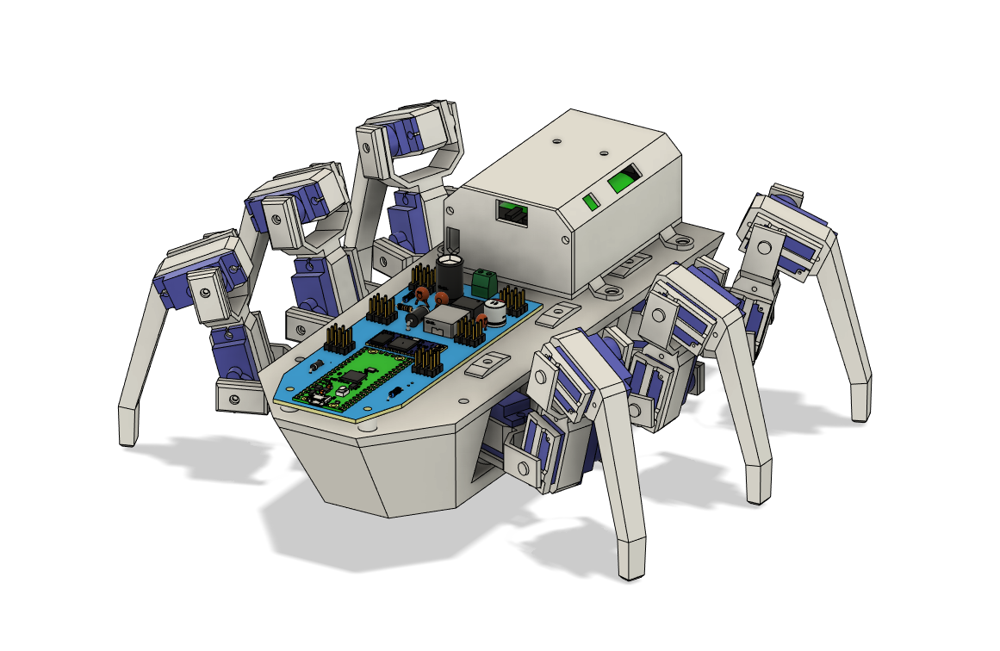
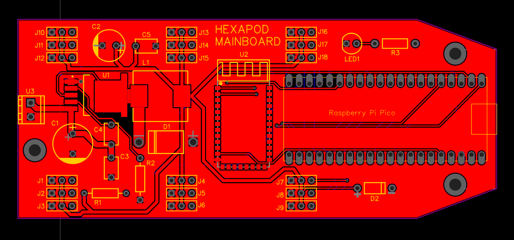
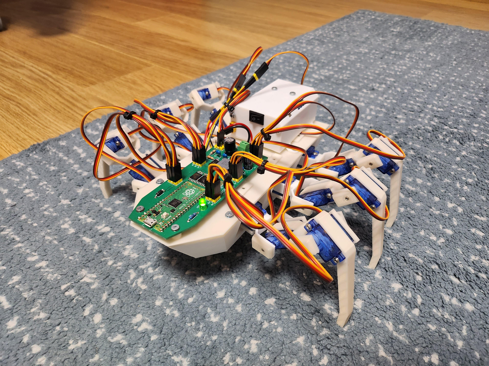

# Bob The Hexapod

Bob The Hexapod is an open source project that aims to present the hexapod platform using cheap and available parts. 

## Hardware

Entire robot is build using 3D printed parts and common electronic components.

Leg motion is handled by 18 SG90 servo motors driven by Raspberry Pi Pico board. The system is powered by DIY 2S li-ion battery pack. Most of the components are centralized on custom PCB board.

STEP files can be found under the [docs/3D](./docs/3D) folder. Similarly PCB gerber files are located in [docs/Gerber](./docs/Gerber).

All 3D parts were designed using Fusion 360 and are suitable for FDM printers. I've used PLA+ filament for mine but anything non-flexible will work. There are total of 58 printed parts needed for this build :D. 

Battery pack is made out of 2 Sony US18650VTC5 li-ion cells in series protected by general 2S BMS circuit. Power output is handled by a pair of XT30 connectors.

Power supply is build around XL4015 IC. Circuit design is based on typical application circuit from its [datasheet](https://datasheet.lcsc.com/szlcsc/1811081616_XLSEMI-XL4015E1_C51661.pdf). Schematic is available in [docs/Gerber](./docs/Gerber) alongside gerber files.

### Basic parts list

As for electronics you will need the following:

- **Patience :D**
- Raspberry Pi Pico
- HC-05 bluetooth module
- 18 SG90 servos
- XL4015 buck converter IC
- 2 US18650VTC5 cells (or similar)
- Various resistor, capacitors and diodes

Detailed components BOM (bill of materials) is located in the [docs/Parts](./docs/Parts).

### Printed circuit board

PCB with 2 layers and thickness of 1.6mm is recommended. Soldermask color is not important for this board. Notice that trace width was increased due to higher current requirements. Stencil is not needed although it is better to use one for handful of present SMD parts.

## Software

RPI board was programmed using [PlatformIO](https://platformio.org) and [Arduino-Pico core](https://arduino-pico.readthedocs.io/en/latest). Source code is located in this repository in [src](./src) folder with dependencies in [lib](./lib). Whole project is written in object oriented C++.

There is custom wrapper library for servo control included. Purpose of this addition is to get seamless control over 18 servos by combining PWM channels of RPI pico with PIO based servo control *(RP2040 has max of 16 independent PWM channels)*.

Leg movement is controled by simple inverse kinematics written only for femur and tibia joints (coxa joint si controlled by setting specific angle). This logic is present in [Leg.cpp](./src/Leg.cpp) file.

At the moment, the robot is supposed to be controlled by an Android phone via bluetooth. This [app](https://play.google.com/store/apps/details?id=braulio.calle.bluetoothRCcontroller&pcampaignid=web_share) was used for testing.

## Result

This photo shows fully assembled and programmed *Bob The Hexapod* in action. 

Currently it has a problem with walking on slippery surfaces, but it should be easily resolved by adding rubber feet attachments.

I hope you like the project :D!!